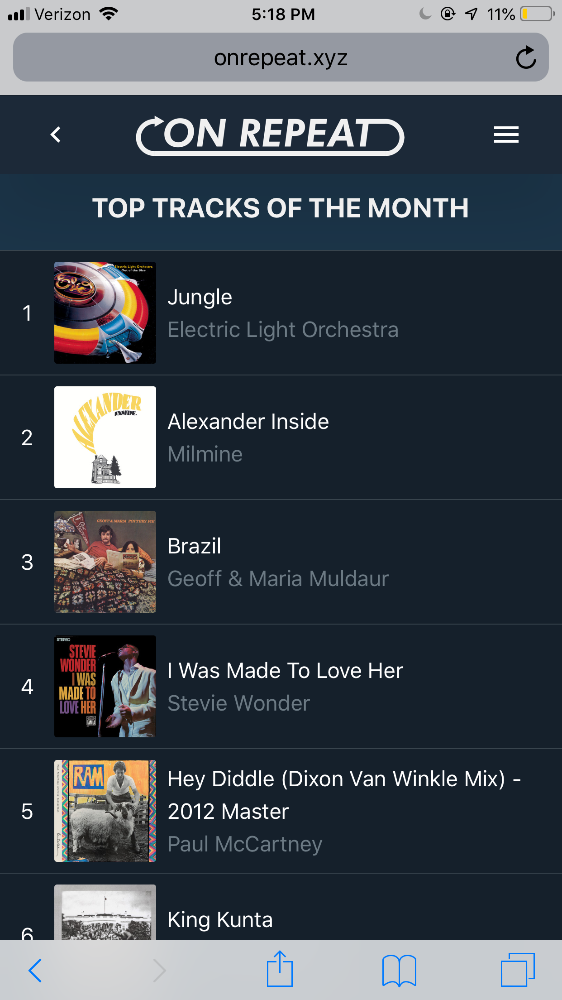

  

On Repeat is a mobile-friendly website that implements the Spotify API to show listener's their top tracks and albums of the month, year, and of all time. The website is written in pure JavaScript and styled using Bootstrap. The RESTful backend of the website runs on a Node.js Express server hosted on Google Cloud. Click [here](http://onrepeat.xyz) to try On Repeat for yourself.

  

